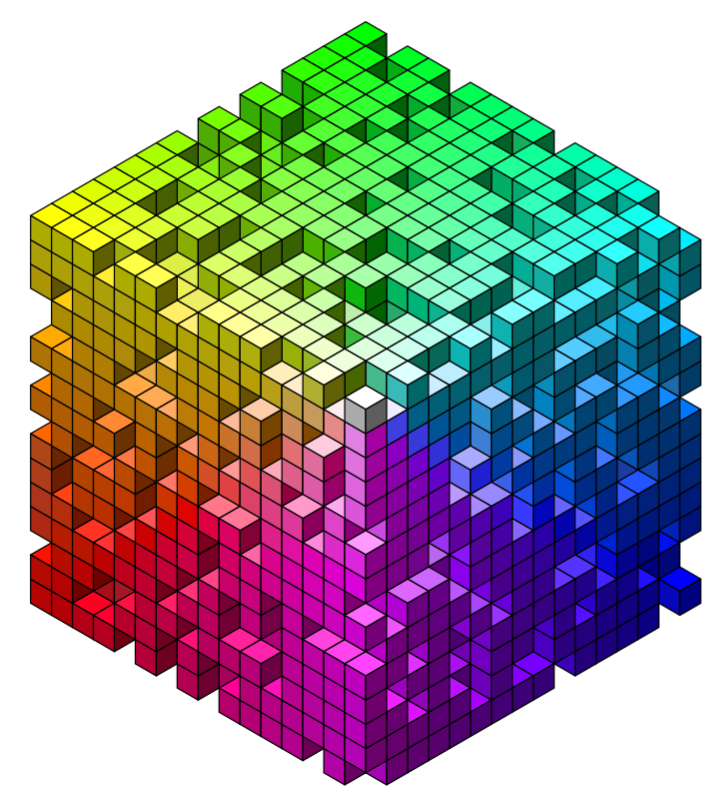

<!-- README.md is generated from README.Rmd. Please edit that file -->

```{r, include = FALSE}
knitr::opts_chunk$set(
  collapse = TRUE,
  comment = "#>",
  fig.path = "man/figures/README-",
  out.width = "100%"
)

library(grid)
library(isocubes)
library(dplyr)

set.seed(1)
```

# isocubes  

<!-- badges: start -->

<!-- badges: end -->

`{isocubes}` is an isometric rendering canvas with cubes as the only graphics primitive.


## What's in the box

* `isocubesGrob()` to convert 3d integer coordinates into a grob for plotting
* `coord_heightmap()` to create coordinates for a heightmap from a matrix and (optional)
  colour information
* `coord_sphere()` to create coordinates for all isocubes within a sphere

#### Coordinate system

* `xc` and `yc` give the positition of the origin of the isometric view within
  the graphics window.
* `max_y` is the main control for cube sizing.  This value is the number of 
  cubes that can be stacked to fill the vertical extents of the window.
  Higher values of `max_y` means smaller cubes.
* The isometric view is a left-handed coordinate system with `y` vertical.
* The `(x, y, z)` coordinates given to position the cubes will be rounded to the
  nearest integer.  There is no fractional positioning of cubes.


#### Why isometric?

Isometric cubes have advantages over other axonometric and perspective coordinate
systems:

* No perspective correction needed.
* No foreshortening along different dimensions.
* The cube is just a hexagon with each third shaded differently, and the
  polygons for each face are trivial to calculate and draw. 
* The rules for occlusion are simple i.e. it's easy to cull cubes 
  from the drawing process if they're hidden behind other cubes and won't 
  be seen.   Fewer cubes mean a faster rendering time.

## Installation

You can install from [GitHub](https://github.com/coolbutuseless/isocubes) with:

``` r
# install.package('remotes')
remotes::install_github('coolbutuseless/isocubes')
```


## 'R' in isocubes


```{r example, fig.height = 4}
library(grid)
library(purrr)
library(isocubes)

x <- c(9, 8, 7, 6, 5, 4, 3, 2, 10, 9, 3, 2, 11, 10, 3, 2, 11, 10, 
3, 2, 11, 10, 3, 2, 11, 10, 3, 2, 10, 9, 3, 2, 9, 8, 7, 6, 5, 
4, 3, 2, 10, 9, 3, 2, 11, 10, 3, 2, 11, 10, 3, 2, 11, 10, 3, 
2, 11, 10, 3, 2, 11, 10, 3, 2, 11, 10, 3, 2)

y <- c(15, 15, 15, 15, 15, 15, 15, 15, 14, 14, 14, 14, 13, 13, 13, 
13, 12, 12, 12, 12, 11, 11, 11, 11, 10, 10, 10, 10, 9, 9, 9, 
9, 8, 8, 8, 8, 8, 8, 8, 8, 7, 7, 7, 7, 6, 6, 6, 6, 5, 5, 5, 5, 
4, 4, 4, 4, 3, 3, 3, 3, 2, 2, 2, 2, 1, 1, 1, 1)

coords <- data.frame(x = x, y = y, z = 0)
cubes  <- isocubesGrob(coords, max_y = 25)
grid.newpage(); grid.draw(cubes)
# Colour the cubes with rainbow
cubes <- isocubesGrob(coords, fill = rainbow(nrow(coords)), max_y = 25)
grid.newpage(); grid.draw(cubes)
# VaporWave palette
cubes <- isocubesGrob(coords, fill = '#ff71ce', fill_left = '#01cdfe',
                      fill_right = '#05ffa1', max_y = 25)
grid.newpage(); grid.draw(cubes)
# Nightmare palette
cubes <- isocubesGrob(coords, 
                      fill = rainbow(nrow(coords)), 
                      fill_left = 'hotpink',
                      fill_right = viridisLite::inferno(nrow(coords)), 
                      max_y = 25, col = NA)
grid.newpage(); grid.draw(cubes)
```


## Calculate isocubes within a sphere


```{r sphere}
library(grid)
library(isocubes)

N      <- 13
coords <- expand.grid(x=seq(-N, N), y = seq(-N, N), z = seq(-N, N))
keep   <- with(coords, sqrt(x * x + y * y + z * z)) < N
coords <- coords[keep,]

cubes <- isocubesGrob(coords, max_y = 35, xc = 0.5, yc = 0.5)
grid.newpage()
grid.draw(cubes)
```


## Random rainbow volume of isocubes


```{r rainbow}
library(isocubes)

N      <- 15
coords <- expand.grid(x=0:N, y=0:N, z=0:N)
coords <- coords[sample(nrow(coords), 0.66 * nrow(coords)),]
fill   <- rgb(red = 1 - coords$x / N, coords$y /N, 1 - coords$z/N, maxColorValue = 1)

cubes <- isocubesGrob(coords, fill, max_y = 40, occlusion_depth = 4)
grid.newpage()
grid.draw(cubes)
```


## Heightmap as isocubes

```{r}
#~~~~~~~~~~~~~~~~~~~~~~~~~~~~~~~~~~~~~~~~~~~~~~~~~~~~~~~~~~~~~~~~~~~~~~~~~~~~~
# Prepare a matrix of values, and an (optional) matrix of colours
#~~~~~~~~~~~~~~~~~~~~~~~~~~~~~~~~~~~~~~~~~~~~~~~~~~~~~~~~~~~~~~~~~~~~~~~~~~~~~
mat <- volcano
mat[seq(nrow(mat)),] <- mat[rev(seq(nrow(mat))),]
val <- as.vector(mat)
val <- round(255 * (val - min(val)) / diff(range(val)))
col <- matrix("", nrow=nrow(mat), ncol=ncol(mat))
col[] <- viridisLite::inferno(256)[val + 1L]

#~~~~~~~~~~~~~~~~~~~~~~~~~~~~~~~~~~~~~~~~~~~~~~~~~~~~~~~~~~~~~~~~~~~~~~~~~~~~~
# Find the (integer) coordiinates of the cubes in the heightmap
#~~~~~~~~~~~~~~~~~~~~~~~~~~~~~~~~~~~~~~~~~~~~~~~~~~~~~~~~~~~~~~~~~~~~~~~~~~~~~
coords <- coords_heightmap(mat - min(mat), col = col, scale = 0.3)

#~~~~~~~~~~~~~~~~~~~~~~~~~~~~~~~~~~~~~~~~~~~~~~~~~~~~~~~~~~~~~~~~~~~~~~~~~~~~~
# Convert the coordinates into a grob
#~~~~~~~~~~~~~~~~~~~~~~~~~~~~~~~~~~~~~~~~~~~~~~~~~~~~~~~~~~~~~~~~~~~~~~~~~~~~~
cubes  <- isocubesGrob(coords, max_y = 100, fill = coords$col)
grid.newpage(); grid.draw(cubes)
```


## Image as isocubes

* Treat image to a heightmap

```{r}
img <- png::readPNG("man/figures/Rlogo-small-blur.png")
ht        <- round( 10 * (1 - img[,,2]) )
ht[,1]    <- 0 # image editing to remove rubbish
col       <- rgb(img[,,1], img[,,2], img[,,3])
dim(col)  <- dim(ht) 

col <- t(col[rev(seq(nrow(col))),])
ht  <- t(ht [rev(seq(nrow(ht ))),])

coords <- coords_heightmap(ht, col = col)
cubes  <- isocubesGrob(coords, max_y = 100, fill = coords$col, col = 'grey20')
grid.newpage(); grid.draw(cubes)

```


## Technical Bits

#### Cube occlusion

In an isometric view, a cube at position `(x, y, z)` will block the view
of any cube at `(x + n, y - n, z + n)`.

Since cube positions must be integer values, hashes of cube positions are 
calculated as `x + (y * 256) + (z * 256^2)`.

For each initial cube position, calculate the hash or coordinates of several 
occluded cubes. Then remove any initial cubes which match the occluded cube
hashes.

#### Cube sort

Arrange cubes by `-x`, `-z` then `y` to ensure cubes are drawn in the correct 
ordering such that cubes in front are drawn over the top of cubes which
are behind.

#### grob

All the faces of all the cubes are then calculated as polygons - each with 
4 vertices.

The data for all polygons is then concatenated into a single `polygonGrob()`
call with an appropiate vector for `id.lengths` to split the data.

## Acknowledgements

* R Core for developing and maintaining the language.
* CRAN maintainers, for patiently shepherding packages onto CRAN and maintaining
  the repository
