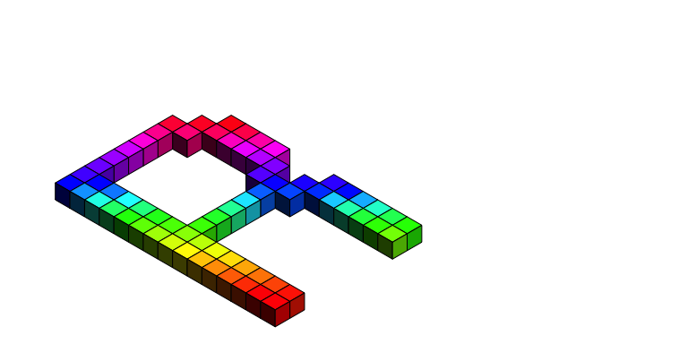

<!-- README.md is generated from README.Rmd. Please edit that file -->

# isocubes 

<!-- badges: start -->


[](https://github.com/coolbutuseless/isocubes/actions/workflows/R-CMD-check.yaml)
<!-- badges: end -->

`isocubes` is a volume renderer using isometric cubes as the 3D pixel
element.

## What’s in the box

- `isocubesGrob()` - create isometric cubes
- `isolinesGrob()` - create isometric grids of lines
- `isopointsGrob()` - create isometric grids of points
- `isoaxesGrob()` - create lines representing x,y,z axes
- `calc_heightmap_coords()` calculate coordinates for a height-map from
  a matrix of values
- Transforms:
  - `coords_translate()`
  - `coords_rotate()`
  - `coords_align()` a custom translation to align the edges or centroid
    of an object with a particular location
- Example objects:
  - `obj_letter` The letter ‘R’
  - `obj_sphere` A sphere
  - `obj_organic` An organic shape

## Installation

<!-- This package can be installed from CRAN -->

<!-- ``` r -->

<!-- install.packages('isocubes') -->

<!-- ``` -->

You can install the latest development version from
[GitHub](https://github.com/coolbutuseless/isocubes) with:

``` r
# install.package('remotes')
install.packages('colorfast')
remotes::install_github('coolbutuseless/isocubes')
```

Pre-built source/binary versions can also be installed from
[R-universe](https://r-universe.dev)

``` r
install.packages('isocubes', repos = c('https://coolbutuseless.r-universe.dev', 'https://cloud.r-project.org'))
```

## ‘R’ in isocubes

``` r
library(grid)

# Coordinates for a letter 'R' included with this package
head(obj_letter)
#>   x  y z
#> 1 7 14 0
#> 2 6 14 0
#> 3 5 14 0
#> 4 4 14 0
#> 5 3 14 0
#> 6 2 14 0

cubes  <- isocubesGrob(obj_letter, size = 5, x = 0.4, y = 0.05)
gnd    <- isolinesGrob(size = 5, x = 0.4, y = 0.05, col = 'grey80')

grid.newpage()
grid.rect(gp = gpar(fill = 'deepskyblue3'))
grid.draw(gnd)
grid.draw(cubes)
```


``` r
# Change the relative intensity of the shading of each face
cubes  <- isocubesGrob(
  obj_letter, size = 5, 
  x = 0.4, y = 0.05, 
  xyplane = 'right',
  fill = 'lightblue', intensity = c(0.3, 1, 0.6)
)

grid.newpage(); grid.draw(cubes)
```


``` r
# Colour the cubes with rainbow
cubes <- isocubesGrob(obj_letter, fill = rainbow(nrow(obj_letter)), size = 5, x = 0.4, y = 0.05)
grid.newpage(); grid.draw(cubes)
```



``` r
# VaporWave palette
cubes <- isocubesGrob(obj_letter, fill = '#ff71ce', fill_left = '#01cdfe',
                      xyplane = 'right',
                      fill_right = '#05ffa1', size = 5, x = 0.4, y = 0.05)
grid.newpage(); grid.draw(cubes)
```


``` r
# Nightmare palette
cubes <- isocubesGrob(obj_letter, 
                      fill = rainbow(nrow(obj_letter)), 
                      fill_left = 'hotpink',
                      fill_right = viridisLite::inferno(nrow(obj_letter)), 
                      size = 5, 
                      x = 0.4, y = 0.05,
                      xyplane = 'right',
                      col = NA)
grid.newpage(); grid.draw(cubes)
```


## Visibility checks

When drawing an isocube, the visibility of each face of each cube is
calculated

This at first seems like a lot of work, but it helps in a number of
ways:

- Using a bespoke spatial hash for the coordinates avoids having to do a
  front-to-back sort of all the cubes.
- Only polygons for visible faces are drawn
  - The number of visible faces (at best) approaches 1/3 the number of
    faces which would be drawn if only per-voxel visibility is
    considered.
  - Fewer polygons = faster to actually `grid.draw()` the object
  - Painters algorithm is still required as currently only doing
    per-face visibility, but faces can be half-visible. It would be
    possible to take into account half-face visibility, but that’s left
    for as a future task.


## Simple isosurface - a sphere

A data.frame with coordinates for a sphere is also included in the
package as `obj_sphere`.

``` r
library(grid)
library(isocubes)

N      <- 13
coords <- expand.grid(x=seq(-N, N), y = seq(-N, N), z = seq(-N, N))
keep   <- with(coords, sqrt(x * x + y * y + z * z)) < N
coords <- coords[keep,]

cubes <- isocubesGrob(coords, size = 3)
grid.newpage()
grid.draw(cubes)
```


## Another isosurface

A fancy isosurface by [Stephane Laurent](https://github.com/stla)

A data.frame with coordinates for this organic shape is included in the
package as `obj_organic`.

``` r
library(grid)
library(isocubes)

A <- cospi(3/4); B <- sinpi(3/4)
f <- function(x, y, z) {
  z^4*B^2 + 4*x*y^2*A*B^2 + x*z^2*A*B^2 - 2*z^4*A - 4*x*y^2*B^2 - x*z^2*B^2 + 
    3*z^2*A*B^2 - 2*z^4 - x*A*B^2 - 2*z^2*A + x*B^2 + A*B^2 + 2*z^2 - B^2
}

N <- 31
x <- y <- z <- seq(-N, N) 
coords <- expand.grid(x = x, y = y, z = z)
keep <- with(
  coords, 
  sqrt(x*x + y*y + z*z) < 10*3 & f(x/10, y/10, z/10) < 0 & f(x/10, y/10, z/10) > -2
) 

coords <- coords[keep,]
coords[, c('x', 'y', 'z')] <- coords[ , c('y', 'z', 'x')]
coords$fill <-  rgb(red = 1 + coords$x/N, 1 + coords$y/N, 1 + coords$z/N, maxColorValue = 2)


cubes <- isocubesGrob(coords, size = 2)
grid.newpage()
grid.draw(cubes)
```


## Random rainbow volume of isocubes

``` r
library(isocubes)
set.seed(1)

N      <- 15
coords <- expand.grid(x=0:N, y=0:N, z=0:N)
coords <- coords[sample(nrow(coords), 0.66 * nrow(coords)),]
fill   <- rgb(red = coords$z / N, 1 - coords$y / N, 1 - coords$x/N, maxColorValue = 1)

cubes <- isocubesGrob(coords, fill, size = 4, y = 0.05)
grid.newpage(); grid.draw(cubes)
```


## Heightmap as isocubes

``` r
#~~~~~~~~~~~~~~~~~~~~~~~~~~~~~~~~~~~~~~~~~~~~~~~~~~~~~~~~~~~~~~~~~~~~~~~~~~~~~
# Prepare a matrix of values
#~~~~~~~~~~~~~~~~~~~~~~~~~~~~~~~~~~~~~~~~~~~~~~~~~~~~~~~~~~~~~~~~~~~~~~~~~~~~~
mat <- volcano

#~~~~~~~~~~~~~~~~~~~~~~~~~~~~~~~~~~~~~~~~~~~~~~~~~~~~~~~~~~~~~~~~~~~~~~~~~~~~~
# An optional matrix of colours
#~~~~~~~~~~~~~~~~~~~~~~~~~~~~~~~~~~~~~~~~~~~~~~~~~~~~~~~~~~~~~~~~~~~~~~~~~~~~~
val <- as.vector(mat)
val <- round(255 * (val - min(val)) / diff(range(val)))
fill <- terrain.colors(256)[val + 1L]
dim(fill) <- dim(mat) 

#~~~~~~~~~~~~~~~~~~~~~~~~~~~~~~~~~~~~~~~~~~~~~~~~~~~~~~~~~~~~~~~~~~~~~~~~~~~~~
# Find the (integer) coordiinates of the cubes in the heightmap
#~~~~~~~~~~~~~~~~~~~~~~~~~~~~~~~~~~~~~~~~~~~~~~~~~~~~~~~~~~~~~~~~~~~~~~~~~~~~~
coords <- calc_heightmap_coords(mat - min(mat), fill = fill, scale = 0.3)

#~~~~~~~~~~~~~~~~~~~~~~~~~~~~~~~~~~~~~~~~~~~~~~~~~~~~~~~~~~~~~~~~~~~~~~~~~~~~~
# Convert the coordinates into a grob
#~~~~~~~~~~~~~~~~~~~~~~~~~~~~~~~~~~~~~~~~~~~~~~~~~~~~~~~~~~~~~~~~~~~~~~~~~~~~~
cubes  <- isocubesGrob(coords, size = 1.5, x = 0.65, y = 0)
grid.newpage(); grid.draw(cubes)
```


## Rotated heightmap

Rotate the heightmap around the vertical axis (y-axis)

``` r
#~~~~~~~~~~~~~~~~~~~~~~~~~~~~~~~~~~~~~~~~~~~~~~~~~~~~~~~~~~~~~~~~~~~~~~~~~~~~~
# Recentre the coords on (0, 0, 0)
#~~~~~~~~~~~~~~~~~~~~~~~~~~~~~~~~~~~~~~~~~~~~~~~~~~~~~~~~~~~~~~~~~~~~~~~~~~~~~
coords$x <- coords$x - mean(coords$x)
coords$y <- coords$y - mean(coords$y)
coords$z <- coords$z - mean(coords$z)

#~~~~~~~~~~~~~~~~~~~~~~~~~~~~~~~~~~~~~~~~~~~~~~~~~~~~~~~~~~~~~~~~~~~~~~~~~~~~~
# Rotate the coordinates around the z-axis
#~~~~~~~~~~~~~~~~~~~~~~~~~~~~~~~~~~~~~~~~~~~~~~~~~~~~~~~~~~~~~~~~~~~~~~~~~~~~~
theta <- -pi/3
tmp      <- coords$x * cos(theta) + coords$y * -sin(theta)
coords$y <- coords$x * sin(theta) + coords$y *  cos(theta)
coords$x <- tmp

#~~~~~~~~~~~~~~~~~~~~~~~~~~~~~~~~~~~~~~~~~~~~~~~~~~~~~~~~~~~~~~~~~~~~~~~~~~~~~
# Regnerate the cubes
#~~~~~~~~~~~~~~~~~~~~~~~~~~~~~~~~~~~~~~~~~~~~~~~~~~~~~~~~~~~~~~~~~~~~~~~~~~~~~
cubes  <- isocubesGrob(coords, size = 1.5)
grid.newpage(); grid.draw(cubes)
```


## Save rendered voxels

Remember:

- default output units for the cubes is in the absolute units of ‘mm’
- Change cube size in output by
  - increasing the value of the `size` argument
  - changing to relative coordinates so that cubes scale with the size
    of the output canvas
    e.g. `isocubesGrob(..., default.units = 'npc', size = 0.01)`

### PNG

``` r
#~~~~~~~~~~~~~~~~~~~~~~~~~~~~~~~~~~~~~~~~~~~~~~~~~~~~~~~~~~~~~~~~~~~~~~~~~~~~~
# output to image with PNG, PDF etc
#~~~~~~~~~~~~~~~~~~~~~~~~~~~~~~~~~~~~~~~~~~~~~~~~~~~~~~~~~~~~~~~~~~~~~~~~~~~~~
png("working/output.png", width = 800, height = 600)
grid.draw(cubes)
dev.off()
```

### SVG

- `svglite` graphics device seems to be best here.
- `gridSVG::grid.export()` output is very slow.

``` r
library(svglite)
svglite::svglite("working/output.svg")
grid.draw(cubes)
dev.off()
#> quartz_off_screen 
#>                 2
```

## Image as isocubes

- Treat image to a heightmap

``` r
#~~~~~~~~~~~~~~~~~~~~~~~~~~~~~~~~~~~~~~~~~~~~~~~~~~~~~~~~~~~~~~~~~~~~~~~~~~~~~
# Load image and convert to a matrix of heights
#~~~~~~~~~~~~~~~~~~~~~~~~~~~~~~~~~~~~~~~~~~~~~~~~~~~~~~~~~~~~~~~~~~~~~~~~~~~~~
img <- png::readPNG("man/figures/Rlogo-small-blur.png")
ht        <- round( 10 * (1 - img[,,2]) ) # Use Green channel intensity as height
ht[,1]    <- 0 # image editing to remove some artefacts

#~~~~~~~~~~~~~~~~~~~~~~~~~~~~~~~~~~~~~~~~~~~~~~~~~~~~~~~~~~~~~~~~~~~~~~~~~~~~~
# A matrix of colours extracted from the image
#~~~~~~~~~~~~~~~~~~~~~~~~~~~~~~~~~~~~~~~~~~~~~~~~~~~~~~~~~~~~~~~~~~~~~~~~~~~~~
fill       <- rgb(img[,,1], img[,,2], img[,,3])
dim(fill)  <- dim(ht) 

#~~~~~~~~~~~~~~~~~~~~~~~~~~~~~~~~~~~~~~~~~~~~~~~~~~~~~~~~~~~~~~~~~~~~~~~~~~~~~
# convert to cubes and draw
#~~~~~~~~~~~~~~~~~~~~~~~~~~~~~~~~~~~~~~~~~~~~~~~~~~~~~~~~~~~~~~~~~~~~~~~~~~~~~
coords <- calc_heightmap_coords(ht, fill = fill, ground = 'xy')
cubes  <- isocubesGrob(coords, size = 1.3, x = 0.4, y = 0, col = NA, intensity = c(0.6, 0.4, 1), 
                       handedness = 'right')
grid.newpage(); grid.draw(cubes)
```


## Terrain with `ambient`

``` r
library(grid)
library(ggplot2)
library(dplyr)
library(ambient)

#~~~~~~~~~~~~~~~~~~~~~~~~~~~~~~~~~~~~~~~~~~~~~~~~~~~~~~~~~~~~~~~~~~~~~~~~~~~~
# Create some perlin noise on an NxN grid
#~~~~~~~~~~~~~~~~~~~~~~~~~~~~~~~~~~~~~~~~~~~~~~~~~~~~~~~~~~~~~~~~~~~~~~~~~~~~
set.seed(3)
N <- 60

dat <- long_grid(x = seq(0, 10, length.out = N), y = seq(0, 10, length.out = N)) %>% 
  mutate(
    noise = 
      gen_perlin(x, y, frequency = 0.3) + 
      gen_perlin(x, y, frequency = 2) / 10
  ) 

hm <- dat %>%
  mutate(
    x = x * 4,
    y = y * 4,
    z = noise * 8
  )

pal  <- topo.colors(11)
sy   <- as.integer(10 * (hm$z - min(hm$z)) / diff(range(hm$z))) + 1
cols <- pal[sy]

cubes  <- isocubesGrob(hm, size = 3, fill = cols, col = NA, y = 0)

grid.newpage(); grid.draw(cubes)
```


## Coordinate system

There are 3 ways in which the XY plane could be oriented with `xyplane`
argument:

1.  Aligned with the `left` face of the isocube
2.  Aligned with the \`right\`\` face of the isocube
3.  Aligned with the `top` face of the isocube (also called `flat`)

There are two possible “handed-ness” settings:

1.  `left` for left-handed coordinate system
2.  `right` for right-handed coordinate system

Use `isoaxesGrob()` to add an axis guide (directions for x,y,z are
colored red,green,blue respectively).

``` r
library(grid)
library(isocubes)
library(lofifonts)

coords <- lofifonts::bitmap_text_coords('I\u2764#RStats')
coords$z <- 0

cols <- rainbow(nrow(coords))

cubes  <- isocubesGrob(
  coords, x = 0, y = 0, size = 2.5, fill = cols, 
  xyplane = 'right', handedness = 'left'
)

grid.newpage(); 
grid.draw(cubes)

isoaxesGrob(xyplane = 'right', handedness = 'left', x = 0.5, y = 0.25) |>
  grid.draw()
```


``` r
library(grid)
library(isocubes)
library(lofifonts)

coords <- lofifonts::bitmap_text_coords('I\u2764#RStats')
coords$z <- 0

cols <- rainbow(nrow(coords))

cubes  <- isocubesGrob(
  coords, x = 0.1, y = 0, size = 2.5, fill = cols, 
  xyplane = 'flat', handedness = 'right'
)

grid.newpage(); 
grid.draw(cubes)


isoaxesGrob(xyplane = 'flat', handedness = 'right', x = 0.5, y = 0.25) |>
  grid.draw()
```


``` r
library(grid)
library(isocubes)
library(lofifonts)

coords <- lofifonts::bitmap_text_coords('I\u2764#RStats')
coords$z <- 0

cols <- rainbow(nrow(coords))

cubes  <- isocubesGrob(
  coords, x = 0, y = 0.7, size = 2.5, fill = cols, 
  xyplane = 'left', handedness = 'right'
)

grid.newpage(); 
grid.draw(cubes)


isoaxesGrob(xyplane = 'left', handedness = 'right', x = 0.5, y = 0.75) |>
  grid.draw()
```


### See also

- [isocuboids](https://github.com/cj-holmes/isocuboids)
- [oblicubes](https://cran.r-project.org/package=oblicubes)
