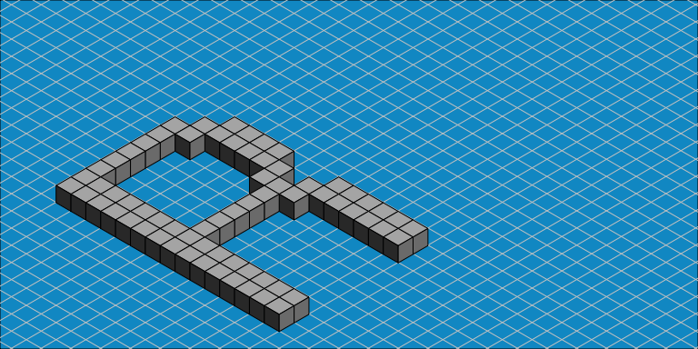
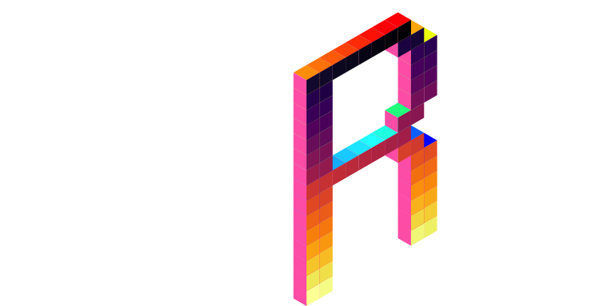

<!-- README.md is generated from README.Rmd. Please edit that file -->

# isocubes 

<!-- badges: start -->


[](https://github.com/coolbutuseless/isocubes/actions/workflows/R-CMD-check.yaml)
<!-- badges: end -->

`isocubes` is a voxel renderer using a fixed-view isometric cube as the
rendering primitive.

### See also

- [isocuboids](https://github.com/cj-holmes/isocuboids)
- [oblicubes](https://cran.r-project.org/package=oblicubes)

## What’s in the box

- `isocubesGrob()` to convert 3d integer coordinates into a grob for
  plotting
- `coord_heightmap()` to create coordinates for a heightmap from a
  matrix and (optional) colour information

## Coordinate system

- The size and positioning of the isometric coordinate system is
  controlled by arguments `isocubesGrob(coords, ysize, xo, yo)`
- `xo` and `yo` give the position of the origin of the isometric view
  within the graphics window. These are fractional values which will be
  interpreted as `snpc` units i.e. fractional width and height of the
  graphics devices.
- `ysize` is the main control for cube sizing. This value is the height
  of the cube expressed as a fraction of the window height.  
- The isometric view is a left-handed coordinate system with `y`
  vertical.
- The `(x, y, z)` coordinates given to position the cubes will be
  rounded to the nearest integer. There is no fractional positioning of
  cubes.


## Installation

You can install from
[GitHub](https://github.com/coolbutuseless/isocubes) with:

``` r
# install.package('remotes')
remotes::install_github('coolbutuseless/isocubes')
```

## ‘R’ in isocubes

``` r
library(grid)
library(purrr)
library(isocubes)

x <- c(9, 8, 7, 6, 5, 4, 3, 2, 10, 9, 3, 2, 11, 10, 3, 2, 11, 10, 
3, 2, 11, 10, 3, 2, 11, 10, 3, 2, 10, 9, 3, 2, 9, 8, 7, 6, 5, 
4, 3, 2, 10, 9, 3, 2, 11, 10, 3, 2, 11, 10, 3, 2, 11, 10, 3, 
2, 11, 10, 3, 2, 11, 10, 3, 2, 11, 10, 3, 2) - 2

y <- c(15, 15, 15, 15, 15, 15, 15, 15, 14, 14, 14, 14, 13, 13, 13, 
13, 12, 12, 12, 12, 11, 11, 11, 11, 10, 10, 10, 10, 9, 9, 9, 
9, 8, 8, 8, 8, 8, 8, 8, 8, 7, 7, 7, 7, 6, 6, 6, 6, 5, 5, 5, 5, 
4, 4, 4, 4, 3, 3, 3, 3, 2, 2, 2, 2, 1, 1, 1, 1) - 1

coords <- data.frame(x = x, y = y, z = 0)
cubes  <- isocubesGrob(coords, xo = 0.5, yo = 0)
grid.newpage(); grid.draw(cubes)

grid.points(0.5, 0, default.units = 'snpc', gp = gpar(col = 'red', fill = 'red'))
```



``` r
# Colour the cubes with rainbow
cubes <- isocubesGrob(coords, fill = rainbow(nrow(coords)), size = grid::unit(1/20, 'npc'))
grid.newpage(); grid.draw(cubes)
```


``` r
# VaporWave palette
cubes <- isocubesGrob(coords, fill = '#ff71ce', fill2 = '#01cdfe',
                      fill3 = '#05ffa1', ysize = 1/25)
grid.newpage(); grid.draw(cubes)
```


``` r
# Nightmare palette
cubes <- isocubesGrob(coords, 
                      fill = rainbow(nrow(coords)), 
                      fill2 = 'hotpink',
                      fill3 = viridisLite::inferno(nrow(coords)), 
                      ysize = 1/25, col = NA)
grid.newpage(); grid.draw(cubes)
```



## Calculate isocubes within a sphere

``` r
library(grid)
library(isocubes)

N      <- 13
coords <- expand.grid(x=seq(-N, N), y = seq(-N, N), z = seq(-N, N))
keep   <- with(coords, sqrt(x * x + y * y + z * z)) < N
coords <- coords[keep,]

cubes <- isocubesGrob(coords, ysize = 1/35, xo = 0.5, yo = 0.5)
grid.newpage()
grid.draw(cubes)
```


## Random rainbow volume of isocubes

``` r
library(isocubes)

N      <- 15
coords <- expand.grid(x=0:N, y=0:N, z=0:N)
coords <- coords[sample(nrow(coords), 0.66 * nrow(coords)),]
fill   <- rgb(red = 1 - coords$x / N, coords$y /N, 1 - coords$z/N, maxColorValue = 1)

cubes <- isocubesGrob(coords, fill, ysize = 1/40)
grid.newpage()
grid.draw(cubes)
```


## Heightmap as isocubes

``` r
#~~~~~~~~~~~~~~~~~~~~~~~~~~~~~~~~~~~~~~~~~~~~~~~~~~~~~~~~~~~~~~~~~~~~~~~~~~~~~
# Prepare a matrix of values
#~~~~~~~~~~~~~~~~~~~~~~~~~~~~~~~~~~~~~~~~~~~~~~~~~~~~~~~~~~~~~~~~~~~~~~~~~~~~~
mat <- volcano

#~~~~~~~~~~~~~~~~~~~~~~~~~~~~~~~~~~~~~~~~~~~~~~~~~~~~~~~~~~~~~~~~~~~~~~~~~~~~~
# An optional matrix of colours
#~~~~~~~~~~~~~~~~~~~~~~~~~~~~~~~~~~~~~~~~~~~~~~~~~~~~~~~~~~~~~~~~~~~~~~~~~~~~~
val <- as.vector(mat)
val <- round(255 * (val - min(val)) / diff(range(val)))
col <- viridisLite::viridis(256)[val + 1L]
dim(col) <- dim(mat) 

#~~~~~~~~~~~~~~~~~~~~~~~~~~~~~~~~~~~~~~~~~~~~~~~~~~~~~~~~~~~~~~~~~~~~~~~~~~~~~
# Find the (integer) coordiinates of the cubes in the heightmap
#~~~~~~~~~~~~~~~~~~~~~~~~~~~~~~~~~~~~~~~~~~~~~~~~~~~~~~~~~~~~~~~~~~~~~~~~~~~~~
coords <- coords_heightmap(mat - min(mat), col = col, scale = 0.3)

#~~~~~~~~~~~~~~~~~~~~~~~~~~~~~~~~~~~~~~~~~~~~~~~~~~~~~~~~~~~~~~~~~~~~~~~~~~~~~
# Convert the coordinates into a grob
#~~~~~~~~~~~~~~~~~~~~~~~~~~~~~~~~~~~~~~~~~~~~~~~~~~~~~~~~~~~~~~~~~~~~~~~~~~~~~
cubes  <- isocubesGrob(coords, ysize = 1/100, fill = coords$col, xo = 0.8)
grid.newpage(); grid.draw(cubes)
```


## Image as isocubes

- Treat image to a heightmap

``` r
#~~~~~~~~~~~~~~~~~~~~~~~~~~~~~~~~~~~~~~~~~~~~~~~~~~~~~~~~~~~~~~~~~~~~~~~~~~~~~
# Load image and convert to a matrix of heights
#~~~~~~~~~~~~~~~~~~~~~~~~~~~~~~~~~~~~~~~~~~~~~~~~~~~~~~~~~~~~~~~~~~~~~~~~~~~~~
img <- png::readPNG("man/figures/Rlogo-small-blur.png")
ht        <- round( 10 * (1 - img[,,2]) ) # Use Green channel intensity as height
ht[,1]    <- 0 # image editing to remove some artefacts

#~~~~~~~~~~~~~~~~~~~~~~~~~~~~~~~~~~~~~~~~~~~~~~~~~~~~~~~~~~~~~~~~~~~~~~~~~~~~~
# A matrix of colours extracted from the image
#~~~~~~~~~~~~~~~~~~~~~~~~~~~~~~~~~~~~~~~~~~~~~~~~~~~~~~~~~~~~~~~~~~~~~~~~~~~~~
col       <- rgb(img[,,1], img[,,2], img[,,3])
dim(col)  <- dim(ht) 

#~~~~~~~~~~~~~~~~~~~~~~~~~~~~~~~~~~~~~~~~~~~~~~~~~~~~~~~~~~~~~~~~~~~~~~~~~~~~~
# convert to cubes and draw
#~~~~~~~~~~~~~~~~~~~~~~~~~~~~~~~~~~~~~~~~~~~~~~~~~~~~~~~~~~~~~~~~~~~~~~~~~~~~~
coords <- coords_heightmap(ht, col = col, ground = 'xy')
cubes  <- isocubesGrob(coords, ysize = 1/130, fill = coords$col, col = NA, light = 'right-top')
grid.newpage(); grid.draw(cubes)
```


## Fake Terrain with `ambient`

``` r
library(grid)
library(ggplot2)
library(dplyr)
library(ambient)

#~~~~~~~~~~~~~~~~~~~~~~~~~~~~~~~~~~~~~~~~~~~~~~~~~~~~~~~~~~~~~~~~~~~~~~~~~~~~
# Create some perlin noise on an NxN grid
#~~~~~~~~~~~~~~~~~~~~~~~~~~~~~~~~~~~~~~~~~~~~~~~~~~~~~~~~~~~~~~~~~~~~~~~~~~~~
set.seed(3)
N <- 60

dat <- long_grid(x = seq(0, 10, length.out = N), y = seq(0, 10, length.out = N)) %>% 
  mutate(
    noise = 
      gen_perlin(x, y, frequency = 0.3) + 
      gen_perlin(x, y, frequency = 2) / 10
  ) 

hm <- dat %>%
  mutate(
    x = x * 4,
    z = y * 4,
    y = noise * 4
  )

pal  <- topo.colors(11)
sy   <- as.integer(10 * (hm$y - min(hm$y)) / diff(range(hm$y))) + 1
cols <- pal[sy]

cubes  <- isocubesGrob(hm, ysize = 1/45, xo = 0.7, fill = cols, col = NA)

grid.newpage(); grid.draw(cubes)
```


## Bitmap font rendering

``` r
#~~~~~~~~~~~~~~~~~~~~~~~~~~~~~~~~~~~~~~~~~~~~~~~~~~~~~~~~~~~~~~~~~~~~~~~~~~~~
# Convert a 'bittermelon' bitmap list into a set of coordinates for 
# rendering individual pixels
#~~~~~~~~~~~~~~~~~~~~~~~~~~~~~~~~~~~~~~~~~~~~~~~~~~~~~~~~~~~~~~~~~~~~~~~~~~~~
bm_coords <- function(bml, font, sep = NULL) {
  
  if (is.null(sep)) {
    sep = ncol(bml[[1]]) + 0L
  }
  
  coords <- lapply(seq_along(bml), function(i) {
    mat <- bml[[i]]
    mat <- t(mat)
    vec <- which(unclass(mat) == 1)
    coords <- arrayInd(vec, dim(mat))
    coords <- as.data.frame(coords)
    names(coords) <- c('x', 'y')
    coords$idx <- i
    coords$x <- coords$x + i * sep
    coords
  })
  
  coords <- do.call(rbind, coords)
  coords$z <- 0
  
  coords
}
```

``` r
library(grid)
library(isocubes)
library(bittermelon) # on CRAN

font_file <- system.file("fonts/spleen/spleen-8x16.hex.gz", package = "bittermelon")
font <- read_hex(font_file)
bml <- as_bm_list("#RStats!", font = font)

coords <- bm_coords(bml, font)

cols <- rainbow(nrow(coords))

cubes  <- isocubesGrob(coords, xo = 0, ysize = 1/80, fill = cols)
grid.newpage(); 
grid.draw(cubes)
```


## Technical Notes

#### Cube sort

Arrange cubes by `-x`, `-z` then `y` to ensure cubes are drawn in the
correct ordering such that cubes in front are drawn over the top of
cubes which are behind.

#### grob

All the faces of all the cubes are then calculated as polygons - each
with 4 vertices.

The data for all polygons is then concatenated into a single
`polygonGrob()` call with an appropiate vector for `id.lengths` to split
the data.
