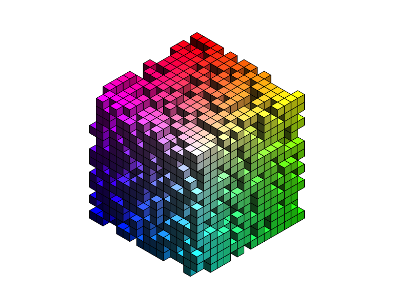
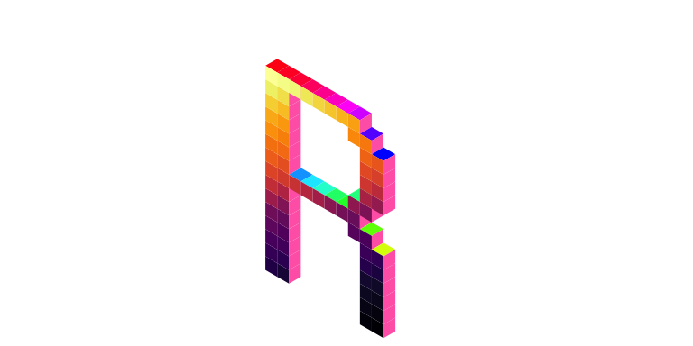
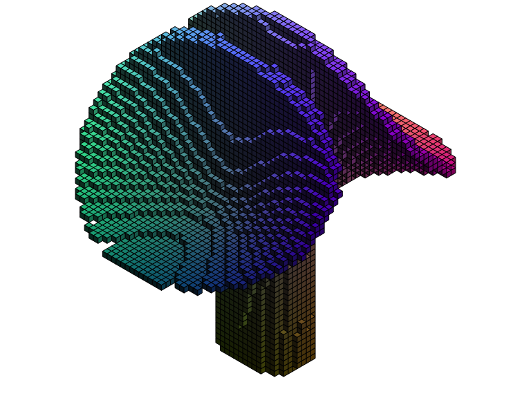

<!-- README.md is generated from README.Rmd. Please edit that file -->

# isocubes 

<!-- badges: start -->


[](https://github.com/coolbutuseless/isocubes/actions/workflows/R-CMD-check.yaml)
<!-- badges: end -->

`isocubes` is a voxel renderer using a fixed-view isometric cube as the
rendering primitive.

### See also

- [isocuboids](https://github.com/cj-holmes/isocuboids)
- [oblicubes](https://cran.r-project.org/package=oblicubes)

## What’s in the box

- `isocubesGrob()` to convert 3d integer coordinates into a grob for
  plotting
- `coord_heightmap()` to create coordinates for a heightmap from a
  matrix and (optional) colour information

## Coordinate system

- Left-Handed vs Right-handed

- Flat = xz, yz, xz

- Illustrate location of ‘fill’, ‘fill_left’ and ‘fill_right’

- Illustrate different lighting locations

## Installation

You can install from
[GitHub](https://github.com/coolbutuseless/isocubes) with:

``` r
# install.package('remotes')
remotes::install_github('coolbutuseless/isocubes')
```

## Coordinate System

``` r
N <- 4
x <- data.frame(x = seq(2, N), y = 1, z = 1)
y <- data.frame(x = 1, y = seq(2, N), z = 1)
z <- data.frame(x = 1, y = 1, z = seq(2, N))
o <- data.frame(x = 1, y = 1, z = 1)

coords <- do.call(rbind, list(o, x, y, z))
fill <- rep(c('red', 'green', 'blue'), each = (N - 1))
fill <- c('grey50', fill)

cubes  <- isocubesGrob(coords, fill = fill, xyplane = 'right', handedness = 'right')
grid.newpage(); grid.draw(cubes)
```


## ‘R’ in isocubes

``` r
library(grid)
library(purrr)

x <- c(9, 8, 7, 6, 5, 4, 3, 2, 10, 9, 3, 2, 11, 10, 3, 2, 11, 10, 
3, 2, 11, 10, 3, 2, 11, 10, 3, 2, 10, 9, 3, 2, 9, 8, 7, 6, 5, 
4, 3, 2, 10, 9, 3, 2, 11, 10, 3, 2, 11, 10, 3, 2, 11, 10, 3, 
2, 11, 10, 3, 2, 11, 10, 3, 2, 11, 10, 3, 2) - 2

y <- c(15, 15, 15, 15, 15, 15, 15, 15, 14, 14, 14, 14, 13, 13, 13, 
13, 12, 12, 12, 12, 11, 11, 11, 11, 10, 10, 10, 10, 9, 9, 9, 
9, 8, 8, 8, 8, 8, 8, 8, 8, 7, 7, 7, 7, 6, 6, 6, 6, 5, 5, 5, 5, 
4, 4, 4, 4, 3, 3, 3, 3, 2, 2, 2, 2, 1, 1, 1, 1) - 1

coords <- data.frame(x = x, y = y, z = 0)
cubes  <- isocubesGrob(coords, xyplane = 'right', handedness = 'left', size = 3, y = 0)
grid.newpage(); grid.draw(cubes)
```


``` r
# Colour the cubes with rainbow
cubes <- isocubesGrob(coords, fill = rainbow(nrow(coords)), size = 5, y = 0)
grid.newpage(); grid.draw(cubes)
```


``` r
# VaporWave palette
cubes <- isocubesGrob(coords, fill = '#ff71ce', fill_left = '#01cdfe',
                      fill_right = '#05ffa1', size = 5, y = 0)
grid.newpage(); grid.draw(cubes)
```


``` r
# Nightmare palette
cubes <- isocubesGrob(coords, 
                      fill = rainbow(nrow(coords)), 
                      fill_left = 'hotpink',
                      fill_right = viridisLite::inferno(nrow(coords)), 
                      size = 5, 
                      y = 0,
                      col = NA)
grid.newpage(); grid.draw(cubes)
```


## Simple isosurface - a sphere

``` r
library(grid)
library(isocubes)

N      <- 13
coords <- expand.grid(x=seq(-N, N), y = seq(-N, N), z = seq(-N, N))
keep   <- with(coords, sqrt(x * x + y * y + z * z)) < N
coords <- coords[keep,]

cubes <- isocubesGrob(coords, size = grid::unit(3, 'mm'), x = 0.5, y = 0.5)
grid.newpage()
grid.draw(cubes)
```


## Another isosurface

A fancy isosurface by [Stephane Laurent](https://github.com/stla)

``` r
library(grid)
library(isocubes)

A <- cospi(3/4); B <- sinpi(3/4)
f <- function(x, y, z) {
  z^4*B^2 + 4*x*y^2*A*B^2 + x*z^2*A*B^2 - 2*z^4*A - 4*x*y^2*B^2 - x*z^2*B^2 + 
    3*z^2*A*B^2 - 2*z^4 - x*A*B^2 - 2*z^2*A + x*B^2 + A*B^2 + 2*z^2 - B^2
}

N <- 31
x <- y <- z <- seq(-N, N) 
coords <- expand.grid(x = x, y = y, z = z)
keep <- with(
  coords, 
  sqrt(x*x + y*y + z*z) < 10*3 & f(x/10, y/10, z/10) < 0 & f(x/10, y/10, z/10) > -2
) 
coords <- coords[keep,]

fill <- 
  rgb(red = 1 + coords$x/N, 1 + coords$y/N, 1 + coords$z/N, maxColorValue = 2)
cubes <- isocubesGrob(coords, fill, x = 0.5, y = 0.5, size = grid::unit(2, 'mm'))
grid.newpage()
grid.draw(cubes)
```


## Random rainbow volume of isocubes

``` r
library(isocubes)
set.seed(1)

N      <- 15
coords <- expand.grid(x=0:N, y=0:N, z=0:N)
coords <- coords[sample(nrow(coords), 0.66 * nrow(coords)),]
fill   <- rgb(red = 1 - coords$x / N, coords$y /N, 1 - coords$z/N, maxColorValue = 1)

cubes <- isocubesGrob(coords, fill, size = grid::unit(4, 'mm'), y = 0)
grid.newpage(); grid.draw(cubes)
```



## Heightmap as isocubes

``` r
#~~~~~~~~~~~~~~~~~~~~~~~~~~~~~~~~~~~~~~~~~~~~~~~~~~~~~~~~~~~~~~~~~~~~~~~~~~~~~
# Prepare a matrix of values
#~~~~~~~~~~~~~~~~~~~~~~~~~~~~~~~~~~~~~~~~~~~~~~~~~~~~~~~~~~~~~~~~~~~~~~~~~~~~~
mat <- volcano

#~~~~~~~~~~~~~~~~~~~~~~~~~~~~~~~~~~~~~~~~~~~~~~~~~~~~~~~~~~~~~~~~~~~~~~~~~~~~~
# An optional matrix of colours
#~~~~~~~~~~~~~~~~~~~~~~~~~~~~~~~~~~~~~~~~~~~~~~~~~~~~~~~~~~~~~~~~~~~~~~~~~~~~~
val <- as.vector(mat)
val <- round(255 * (val - min(val)) / diff(range(val)))
col <- viridisLite::viridis(256)[val + 1L]
dim(col) <- dim(mat) 

#~~~~~~~~~~~~~~~~~~~~~~~~~~~~~~~~~~~~~~~~~~~~~~~~~~~~~~~~~~~~~~~~~~~~~~~~~~~~~
# Find the (integer) coordiinates of the cubes in the heightmap
#~~~~~~~~~~~~~~~~~~~~~~~~~~~~~~~~~~~~~~~~~~~~~~~~~~~~~~~~~~~~~~~~~~~~~~~~~~~~~
coords <- coords_heightmap(mat - min(mat), col = col, scale = 0.3)

#~~~~~~~~~~~~~~~~~~~~~~~~~~~~~~~~~~~~~~~~~~~~~~~~~~~~~~~~~~~~~~~~~~~~~~~~~~~~~
# Convert the coordinates into a grob
#~~~~~~~~~~~~~~~~~~~~~~~~~~~~~~~~~~~~~~~~~~~~~~~~~~~~~~~~~~~~~~~~~~~~~~~~~~~~~
cubes  <- isocubesGrob(coords, size = grid::unit(1.5, 'mm'), fill = coords$col, 
                       x = 0.65, y = 0)
grid.newpage(); grid.draw(cubes)
```



## Image as isocubes

- Treat image to a heightmap

``` r
#~~~~~~~~~~~~~~~~~~~~~~~~~~~~~~~~~~~~~~~~~~~~~~~~~~~~~~~~~~~~~~~~~~~~~~~~~~~~~
# Load image and convert to a matrix of heights
#~~~~~~~~~~~~~~~~~~~~~~~~~~~~~~~~~~~~~~~~~~~~~~~~~~~~~~~~~~~~~~~~~~~~~~~~~~~~~
img <- png::readPNG("man/figures/Rlogo-small-blur.png")
ht        <- round( 10 * (1 - img[,,2]) ) # Use Green channel intensity as height
ht[,1]    <- 0 # image editing to remove some artefacts

#~~~~~~~~~~~~~~~~~~~~~~~~~~~~~~~~~~~~~~~~~~~~~~~~~~~~~~~~~~~~~~~~~~~~~~~~~~~~~
# A matrix of colours extracted from the image
#~~~~~~~~~~~~~~~~~~~~~~~~~~~~~~~~~~~~~~~~~~~~~~~~~~~~~~~~~~~~~~~~~~~~~~~~~~~~~
col       <- rgb(img[,,1], img[,,2], img[,,3])
dim(col)  <- dim(ht) 

#~~~~~~~~~~~~~~~~~~~~~~~~~~~~~~~~~~~~~~~~~~~~~~~~~~~~~~~~~~~~~~~~~~~~~~~~~~~~~
# convert to cubes and draw
#~~~~~~~~~~~~~~~~~~~~~~~~~~~~~~~~~~~~~~~~~~~~~~~~~~~~~~~~~~~~~~~~~~~~~~~~~~~~~
coords <- coords_heightmap(ht, col = col, ground = 'xy')
cubes  <- isocubesGrob(coords, size = grid::unit(1.3, 'mm'), fill = coords$col, 
                       x = 0.1, y = 0, col = NA, light = 'right-top')
grid.newpage(); grid.draw(cubes)
```


## Terrain with `ambient`

``` r
library(grid)
library(ggplot2)
library(dplyr)
library(ambient)

#~~~~~~~~~~~~~~~~~~~~~~~~~~~~~~~~~~~~~~~~~~~~~~~~~~~~~~~~~~~~~~~~~~~~~~~~~~~~
# Create some perlin noise on an NxN grid
#~~~~~~~~~~~~~~~~~~~~~~~~~~~~~~~~~~~~~~~~~~~~~~~~~~~~~~~~~~~~~~~~~~~~~~~~~~~~
set.seed(3)
N <- 60

dat <- long_grid(x = seq(0, 10, length.out = N), y = seq(0, 10, length.out = N)) %>% 
  mutate(
    noise = 
      gen_perlin(x, y, frequency = 0.3) + 
      gen_perlin(x, y, frequency = 2) / 10
  ) 

hm <- dat %>%
  mutate(
    x = x * 4,
    z = y * 4,
    y = noise * 4
  )

pal  <- topo.colors(11)
sy   <- as.integer(10 * (hm$y - min(hm$y)) / diff(range(hm$y))) + 1
cols <- pal[sy]

cubes  <- isocubesGrob(hm, size = 3, fill = cols, col = NA, y = 0)

grid.newpage(); grid.draw(cubes)
```



## Bitmap font rendering

``` r
library(grid)
library(isocubes)
library(lofifonts)

coords <- lofifonts::bitmap_text_coords('I\u2764#RStats')
coords$z <- 0

cols <- rainbow(nrow(coords))

cubes  <- isocubesGrob(coords, x = 0, y = 0, size = 2.5, fill = cols)
grid.newpage(); 
grid.draw(cubes)
```


## Technical Notes

#### Cube sort

Arrange cubes by `-x`, `-z` then `y` to ensure cubes are drawn in the
correct ordering such that cubes in front are drawn over the top of
cubes which are behind.

#### grob

All the faces of all the cubes are then calculated as polygons - each
with 4 vertices.

The data for all polygons is then concatenated into a single
`polygonGrob()` call with an appropiate vector for `id.lengths` to split
the data.
